# Mode opératoire — Archives mail partagées (Thunderbird)

**Objectif** : décharger les boîtes saturées (jusqu'à 80 Go) vers une archive partagée sur le SAN, consultable par plusieurs personnes **sans risque de verrou ni de corruption**.

> ✅ **Version recommandée : Thunderbird 140 ESR (ou ultérieure).**
> Ce mode opératoire est écrit pour cette version : interface simplifiée, recherche
> **par ancienneté**, et archivage **automatisable**. Le dispositif reste compatible
> jusqu'à **Thunderbird 31.7.0** (voir **« Compatibilité avec les versions anciennes »**
> en fin de document), mais privilégiez la **140+** partout où c'est possible —
> en particulier sur le **poste central**.

---

## Comment ça marche (en une minute)

1. Sur un **poste central « mail »**, on archive les anciens messages d'une boîte. Thunderbird les range automatiquement **par année-mois** et les retire du serveur (la boîte se vide).
2. Ces fichiers d'archive sont **poussés sur le SAN** (l'archive « maître », qu'on ne modifie plus).
3. Sur **chaque poste utilisateur**, un script recopie l'archive dans un **cache local en lecture seule**. Thunderbird lit ce cache.

**Pourquoi aucun verrou n'est possible :** deux Thunderbird n'ouvrent **jamais** le même fichier. Chacun a sa propre copie locale et son propre index. Le SAN ne sert qu'à distribuer.

**Pourquoi la synchro est rapide :** une fois un mois écoulé, son fichier ne change plus jamais. Seul le mois en cours est recopié à chaque synchro — l'historique ne retransite pas.

### Schéma — architecture

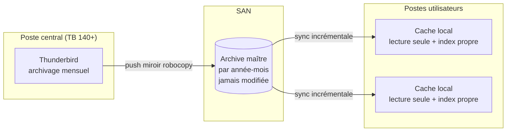

### Schéma — pourquoi aucun verrou n'est possible

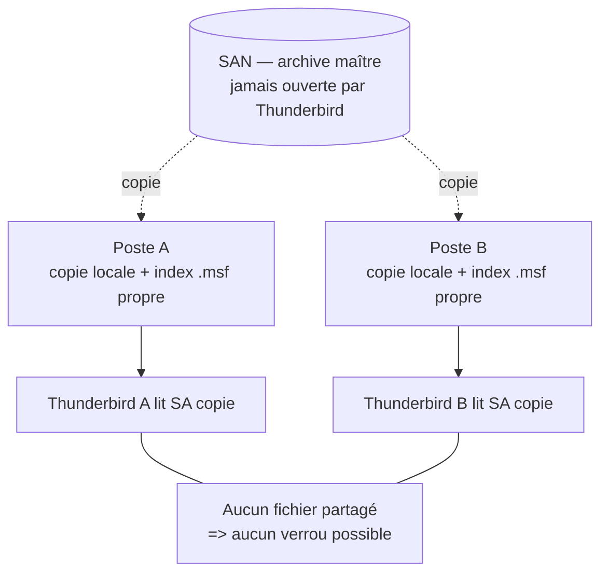

---

## Configurer les scripts (`.bat`) — une seule fois par poste

Tous les scripts sont dans le dossier **`scripts/`**. Avant de lancer un script,
on adapte les **valeurs en haut du fichier** (les lignes `set "NOM=valeur"`).

**Comment éditer un `.bat`** : **clic droit → Modifier** (ouvre le Bloc-notes),
changer les valeurs, **enregistrer**. Pour l'exécuter : **double-cliquer** dessus.

> Les scripts du dépôt ne contiennent que des **exemples** (`\\SERVEUR-SAN`,
> `prenom.nom`). Adaptez-les à votre environnement — et **ne committez pas** vos
> vraies valeurs (laissez les placeholders dans Git, modifiez la copie du poste).

| Script | Sur quel poste (étape) | Variable à adapter | Rôle / exemple |
|---|---|---|---|
| `1-push-archives-vers-san.bat` | Central — **1.5** | `BOITE` | identifiant de la boîte = son sous-dossier sur le SAN — ex. `prenom.nom` |
| | | `DEST` | dossier de destination sur le SAN — ex. `\\SERVEUR-SAN\Partage\Archives-Mail\%BOITE%` |
| `2-sync-cache-local.bat` | Utilisateur — **2.1** | `SOURCE` | sous-dossier SAN de la boîte à consulter — ex. `\\SERVEUR-SAN\Partage\Archives-Mail\prenom.nom` |
| | | `NOM_DOSSIER` | nom affiché sous *Dossiers locaux* — défaut `Archives-Partagees` |
| `3-installer-tache-planifiee.bat` | Utilisateur — **2.1** | *(aucune)* | à placer **dans le même dossier** que `2-sync-cache-local.bat` |
| `5-installer-thunderbird-moderne.bat` | Central — **1.1** | *(optionnel)* `LANGUE`, `PRODUCT` | langue (`fr`) et canal (`esr`) — défauts adaptés, en général rien à changer |
| `aide-dates-archivage.bat` | Central — **1.4** *(vieilles versions)* | *(aucune)* | affiche seulement les dates butoir, n'archive rien |

> 💡 `DEST` réutilise `%BOITE%` : changez **`BOITE`** et `DEST` suit
> automatiquement. Les chemins SAN sont en **UNC** (`\\serveur\partage\…`) :
> vérifiez l'accès (écriture côté central, lecture côté utilisateurs) avant de lancer.

---

## Partie 1 — Poste central « mail » (archivage + envoi sur le SAN)

> À faire par la personne en charge de l'archivage, **une boîte à la fois**, sur un poste en **Thunderbird 140+**.

### Vue d'ensemble du processus

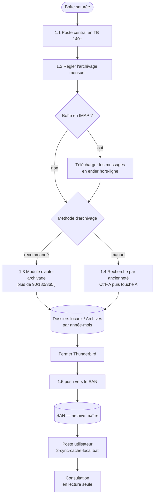

### 1.1 Mettre le poste central en Thunderbird 140+

- **Installation / mise à niveau :** lancer **en administrateur**
  `scripts/5-installer-thunderbird-moderne.bat`. Il télécharge et installe
  **Thunderbird ESR** (branche 140+) en silencieux.
- ⚠️ **Deux versions de Thunderbird ne tournent pas ensemble** par défaut (instance
  unique + verrou de profil). Le plus simple est de **migrer** le poste central vers
  la 140+. Si vous devez vraiment conserver les deux sur la même machine, voir
  *Notes techniques → « Deux versions de Thunderbird sur un même poste »*.

### 1.2 Régler l'archivage mensuel (une fois par compte)

> Indispensable : c'est **ce** réglage **natif de Thunderbird** (et non le module)
> qui range les archives **par année-mois**. AutoarchiveReloaded ne fait que
> déclencher cet archivage natif.

1. **☰ (haut-droite) → Paramètres des comptes** *(ou clic droit sur le compte
   `boite.a.spam@…` dans la colonne de gauche → **Paramètres**)*. Un **onglet** s'ouvre.
2. Dans la colonne de gauche de l'onglet, sous le compte → **Copies et dossiers** ;
   **faire défiler tout en bas** jusqu'à la section **Archives**.
3. Cocher **« Conserver les archives de messages dans : »** → choisir **Dossiers
   locaux** *(c'est là que les scripts vont lire : `Local Folders\Archives`)*.
4. Bouton **« Options d'archivage… »** → choisir **« Archives mensuelles »**
   (un sous-dossier par mois, ex. `Archives/2026/2026-06`) → **OK**.
5. Fermer l'onglet (l'enregistrement est automatique).

*Ouvrir les paramètres du compte — clic droit sur le compte → **Paramètres** (ou via le menu ☰ / ⚙️) :*

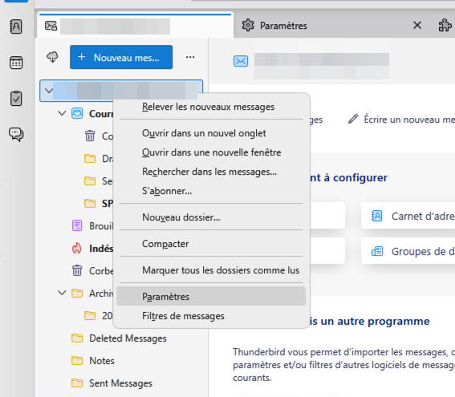

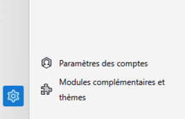

*Onglet **Copies et dossiers** → section **Archives** : conserver les archives dans **Dossiers locaux**, puis **Options d'archivage…** :*

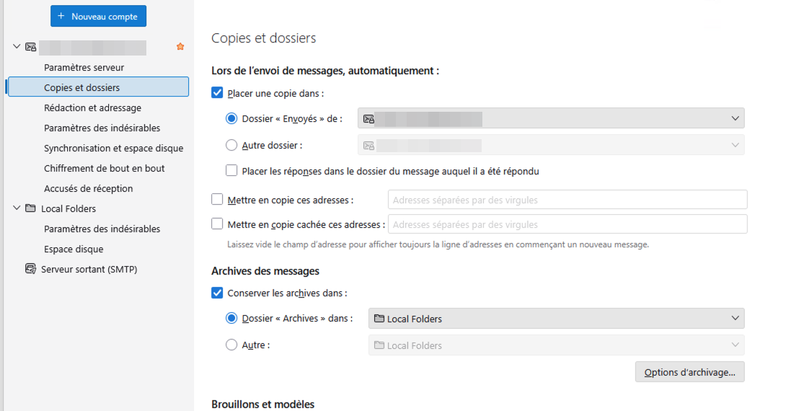

*Dans **Options d'archivage**, choisir **Archives mensuelles** :*

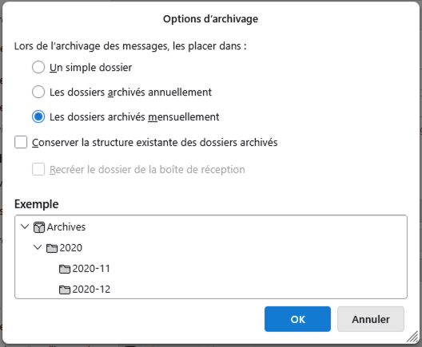

**Vérifier :** sélectionner un vieux message → touche **A** → il doit apparaître sous
**Dossiers locaux → Archives → 2026 → 2026-06** (année / année-mois) :

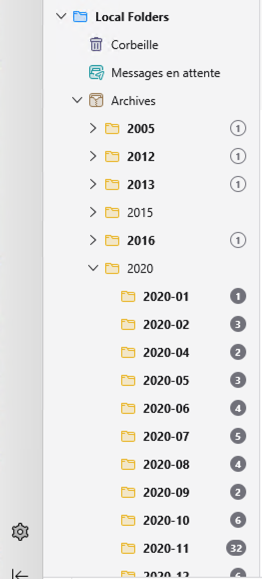

> 🔧 *Cas avancé* — pour un compte **sans interface** (RSS) ou les *Dossiers locaux*
> eux-mêmes (cas évoqué par le message du module) : régler le défaut global via
> **☰ → Paramètres → Général → (tout en bas) Éditeur de configuration…** :
> `mail.identity.default.archive_granularity` = **2** (0 = dossier unique, 1 = annuel,
> **2 = mensuel**) et `mail.identity.default.archive_keep_folder_structure` = **true**.

> ⚠️ **Boîte en IMAP : télécharger d'abord les messages en entier.** Sinon
> Thunderbird n'archive que les **en-têtes** et les messages quittent le serveur
> **sans copie complète locale** → perte de contenu.
> **☰ → Paramètres des comptes → Synchronisation et espace disque** → cocher
> **« Conserver les messages… sur cet ordinateur »**, puis laisser la synchro se
> terminer (compteur de téléchargement à zéro) avant d'archiver.
> *(En POP : rien à faire, les messages sont déjà en local.)*

> 💡 Le classement **mensuel** est indispensable : il permet la **synchro
> incrémentale** (seul le mois en cours retransite ensuite).

### 1.3 Archiver — méthode recommandée : **automatique** (module AutoarchiveReloaded)

Sur 140+, la méthode recommandée consiste à installer le module
**`AutoarchiveReloaded`**, qui archive les messages au-delà d'une ancienneté —
soit **à la demande** (recommandé), soit au démarrage. Il déclenche l'archivage
**natif** → il **conserve le classement année-mois**, indispensable à la synchro
incrémentale.

> 📌 **Le module `AutoarchiveReloaded` doit être installé** sur le poste central.
> Sans lui, **pas d'archivage automatique** : il faudrait alors archiver à la main
> (méthode 1.4).

> 🧭 **Se repérer dans Thunderbird 140 (interface « Supernova ») :**
> - Le menu **☰** est le bouton à **trois traits, en haut à droite** de la fenêtre.
> - Pas de barre de menus visible ? Appuyer sur **Alt** pour l'afficher
>   temporairement (**Fichier / Édition / Affichage / Outils…**), ou clic droit sur
>   la barre d'outils → cocher **Barre de menus** pour la garder.
> - Les **Modules complémentaires** s'ouvrent dans un **onglet** : colonne de gauche
>   **Extensions**, puis chaque module a un bouton **« … »** (trois points) qui donne
>   accès à **Options / Préférences**.

**Étape 1 — installer le module `AutoarchiveReloaded` (une seule fois) :**
1. Dans Thunderbird : **☰ → Modules complémentaires et thèmes**
   *(ou **Outils → Modules complémentaires**)*.
2. Dans la barre de recherche en haut, taper **`AutoarchiveReloaded`**
   *(ou ouvrir directement sa page :
   <https://addons.thunderbird.net/en-US/thunderbird/addon/autoarchivereloaded/>)*.
3. Sur le résultat **AutoarchiveReloaded**, cliquer **« Ajouter à Thunderbird »**
   → **« Ajouter »** → confirmer les autorisations.

   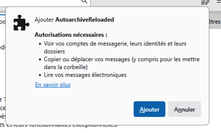

   > *Alternative (hors-ligne / parc) :* depuis la page du module
   > [autoarchivereloaded](https://addons.thunderbird.net/en-US/thunderbird/addon/autoarchivereloaded/),
   > télécharger le fichier **`.xpi`**, puis dans Thunderbird **☰ → Modules
   > complémentaires → ⚙️ → Installer un module depuis un fichier…** et le sélectionner.
   >
   > 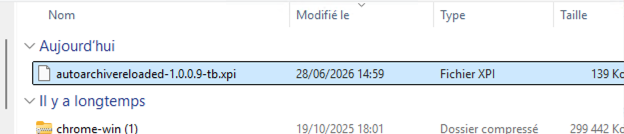
   >
   > 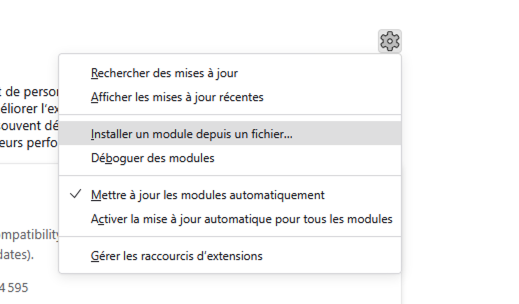
4. **⚠️ Quitter complètement Thunderbird, puis le relancer** après l'installation —
   **même si la mise à jour ne le demande pas**. Le module n'est pleinement actif
   (menu, bouton, archivage) **qu'après ce redémarrage**.

   Le module apparaît ensuite dans **Extensions** (activé) ; la **clé** 🔧 (ou le
   bouton **« … »**) ouvre ses **Options** :

   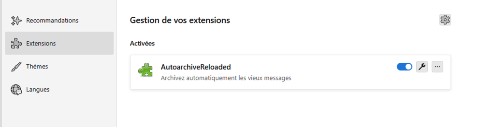

> ⚠️ **Vérifier que `AutoarchiveReloaded` est compatible avec la version de
> Thunderbird installée** (indiqué sur sa page
> [addons.thunderbird.net/…/autoarchivereloaded](https://addons.thunderbird.net/en-US/thunderbird/addon/autoarchivereloaded/)).
> Si la version installée est marquée incompatible, prendre un module
> d'auto-archivage équivalent **maintenu**, ou se rabattre sur la méthode manuelle (1.4).

**Étape 2 — configurer le module :**
5. **☰ → Modules complémentaires et thèmes → Extensions** → sur la ligne
   **AutoarchiveReloaded**, cliquer la **clé** 🔧 (ou le bouton **« … » → Options**)
   *(ou cliquer le nom du module puis l'onglet **Préférences**)*.
6. Ouvrir l'onglet du **compte** concerné (ex. `boite.a.spam@…`), **pas** *Local
   Folders*. Régler l'ancienneté **en jours** (3 mois = **90**, 6 mois = **180**,
   1 an = **365**). Le module distingue **quatre catégories** ; pour **vraiment
   vider** la boîte, **cocher les quatre** avec **le même nombre de jours** (ex.
   180), puis **Sauvegarder les paramètres** :
   - ✅ **Archiver les messages non-lus** de plus de … *(unread)*
   - ✅ **Archives les messages suivis (avec une étoile)** de plus de … *(starred ⭐)*
   - ✅ **Archives les messages étiquetés (avec des mots-clés)** de plus de … *(tagged)*
   - ✅ **Archiver tous les autres messages** de plus de … *(all other)*

   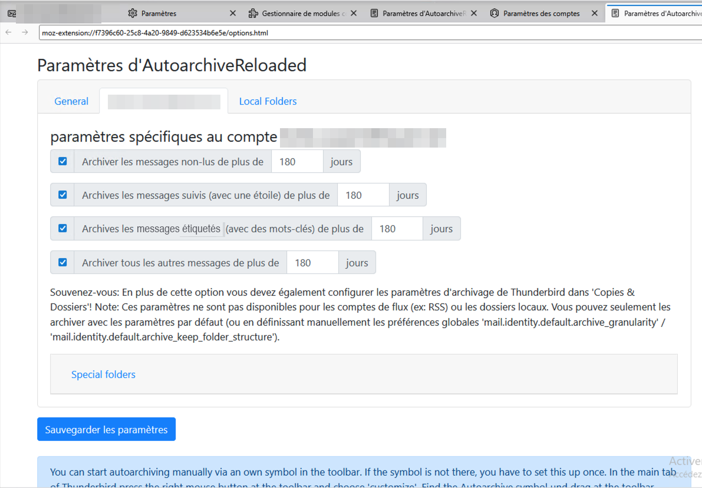

   > Pour **conserver dans la boîte** les messages **suivis (⭐)** et **non lus**
   > même anciens, laisser ces deux options **décochées** (la boîte ne sera alors
   > pas entièrement vidée).
7. Onglet **General** — choisir le **mode d'archivage**, puis **Sauvegarder** :
   - **« manuellement seulement (via les outils) » — recommandé**, surtout en
     **IMAP** : l'archivage au démarrage peut **dupliquer** des messages si la
     connexion/serveur manque ;
   - ou **« à chaque démarrage de Thunderbird »** (pratique en POP/local, déconseillé en IMAP).

   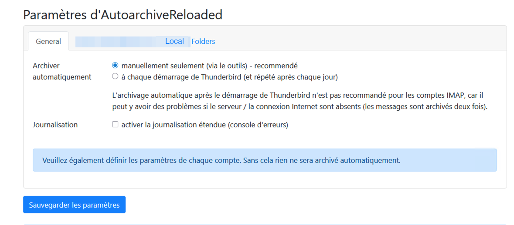

> ⚠️ **Rappel affiché par le module (important) :** AutoarchiveReloaded déclenche
> l'archivage **natif** — il faut donc **aussi** avoir réglé Thunderbird sous
> **Copies et dossiers → Options d'archivage → Archives mensuelles** (étape **1.2**).
> C'est **ce** réglage qui crée le classement **par année-mois** ; sans lui, pas de
> synchro incrémentale.

**Étape 3 — lancer l'archivage :**
8. **Mode manuel (recommandé) :** cliquer le bouton **« Archiver automatiquement
   maintenant »**. S'il n'apparaît pas, l'ajouter une fois via **clic droit sur la
   barre d'outils → Personnaliser**, puis glisser le bouton **Autoarchive** dans la
   barre. Au clic, **confirmer** l'avertissement (une connexion IMAP doit être
   disponible) :

   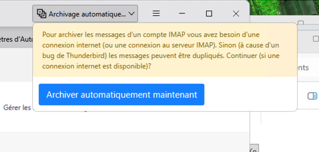

9. *(Si vous avez choisi « à chaque démarrage » à l'étape 7 : il suffit de
   **redémarrer Thunderbird**.)*
10. **Vérifier que ça a marché** : sous **Dossiers locaux → Archives**, les
    sous-dossiers **par année-mois** se remplissent et la boîte d'origine se vide des
    messages au-delà du seuil *(cf. capture du 1.2)*.

**Déploiement en parc (optionnel) :** pour **forcer** l'installation de
`AutoarchiveReloaded` sur plusieurs postes d'un coup, utiliser
`scripts/policies.json.exemple` (stratégie d'entreprise, à copier une fois renseigné
en `…\Mozilla Thunderbird\distribution\policies.json`).

> ⚠️ Le module **archive**, mais **n'envoie pas sur le SAN**. Une fois l'archivage
> fait et **Thunderbird fermé**, lancer le push (1.5). Un enchaînement entièrement
> non surveillé (archive auto → fermeture → robocopy) demanderait une orchestration
> dédiée ; par défaut, gardez le push (1.5) comme geste contrôlé.

### 1.4 Archiver — méthode **manuelle** (recherche par ancienneté)

Pour garder la main, ou pour un traitement ponctuel sans module.

**Seuils de référence :** 3 mois ≈ **90 j** · 6 mois ≈ **180 j** · 1 an = **365 j**.

1. **Clic droit** sur le dossier (ex. *Courrier entrant*) → **Rechercher des
   messages…** *(ou **Ctrl+Maj+F**)*.
2. Vérifier le **dossier** ciblé (cocher *Inclure les sous-dossiers* si besoin).
3. Critère : **« Ancienneté en jours » → « est supérieure à » → 90 / 180 / 365**.
   *(ou **« Date » → « est avant le »** pour une date butoir fixe.)*
4. **Rechercher** → **Ctrl+A** (tout sélectionner) → touche **A**
   *(ou clic droit → **Archiver**, ou le bouton **Archiver** de la barre de message)*.
5. Les messages partent dans **Dossiers locaux → Archives**, classés **par
   année-mois**, et **quittent le serveur**.

> 💡 **Archivage récurrent :** dans la fenêtre de recherche, le bouton
> **« Enregistrer comme dossier de recherche »** crée un **dossier virtuel**
> (ex. *« Plus de 6 mois »*) qui se met à jour seul → y revenir périodiquement et
> faire **Ctrl+A → A**.
>
> *Variante sans recherche :* trier le dossier par la colonne **Date**, sélectionner
> la plage ancienne (**Maj + clic** du 1er au dernier), puis **A**.

### 1.5 Envoyer l'archive sur le SAN

1. **Fermer complètement Thunderbird** (obligatoire : sinon les fichiers sont verrouillés).
2. Adapter **`BOITE`** et **`DEST`** en tête de **`scripts/1-push-archives-vers-san.bat`**
   (voir [Configurer les scripts](#configurer-les-scripts-bat--une-seule-fois-par-poste)).
3. Enregistrer, puis **double-cliquer** sur le script.
4. Il copie l'archive vers le SAN et écrit un journal `_journal-push.log` dans le dossier de destination.

> Pour une nouvelle boîte : reprendre en 1.2 (changer `BOITE`). On peut renommer le dossier *Archives* entre deux boîtes, ou utiliser un profil Thunderbird distinct par boîte.

---

## Partie 2 — Poste utilisateur (consultation en lecture seule)

> À faire sur chaque poste qui doit **consulter** une archive. Aucun logiciel à
> installer : tout est natif Windows. **Thunderbird 140+ recommandé**, mais la
> consultation fonctionne aussi sur les versions anciennes (lecture seule).

### 2.1 Mise en place (une seule fois par poste)

1. Copier les fichiers **`scripts/2-sync-cache-local.bat`** et **`scripts/3-installer-tache-planifiee.bat`** dans un même dossier local, par exemple `C:\Outils\`.
2. Adapter **`SOURCE`** et **`NOM_DOSSIER`** en tête de **`2-sync-cache-local.bat`**
   (voir [Configurer les scripts](#configurer-les-scripts-bat--une-seule-fois-par-poste)).
3. Enregistrer.
4. Double-cliquer sur **`3-installer-tache-planifiee.bat`** : la synchro devient automatique (chaque jour + à l'ouverture de session).
5. Lancer une 1re synchro tout de suite en double-cliquant sur **`2-sync-cache-local.bat`** (la 1re copie peut être longue selon la taille).

### 2.2 Voir les archives dans Thunderbird

1. Ouvrir (ou redémarrer) Thunderbird.
2. Sous **Dossiers locaux**, un dossier **Archives-Partagees** apparaît, avec les sous-dossiers par année-mois, **en lecture seule**.

> Après chaque synchro, **redémarrer Thunderbird** pour voir le mois le plus récent. Un dossier qui semble vide ? Clic droit → **Propriétés → Réparer le dossier** (reconstruit l'index local).

---

## Dépannage rapide

| Symptôme | Cause probable | Solution |
|---|---|---|
| La copie échoue côté central | Thunderbird est resté ouvert | Fermer Thunderbird, relancer le `.bat` |
| Le dossier n'apparaît pas | Thunderbird pas redémarré | Fermer/rouvrir Thunderbird |
| Un dossier semble vide | Index pas encore construit | Clic droit → Propriétés → **Réparer le dossier** |
| « Accès refusé » sur le SAN | Droits manquants | Vérifier les permissions du partage avec l'admin |
| Synchro très longue à chaque fois | Archives en un seul gros fichier | Vérifier que l'archivage est bien en **mensuel** (étape 1.2) |
| Le module n'archive rien | Module incompatible / mal réglé | Vérifier la compatibilité (addons.thunderbird.net) et le seuil d'ancienneté ; sinon, archivage manuel (1.4) |
| Pas de critère « Ancienneté en jours » | Version ancienne (31–45) | Utiliser **Date → est avant le** + `scripts/aide-dates-archivage.bat` (voir Compatibilité) |

---

## Compatibilité avec les versions anciennes (Thunderbird 31 à 45)

Le dispositif fonctionne jusqu'à **Thunderbird 31.7.0**. Réservez de préférence ces
versions aux **postes de consultation** (lecture seule, Partie 2) ; pour le **poste
central**, migrez en **140+** (Partie 1). Spécificités des branches anciennes :

- **Pas d'archivage automatique** : les modules d'auto-archivage exigent TB 60+.
  Sur 31–45, l'archivage est **manuel** (méthode 1.4).
- **Critère « Ancienneté en jours » absent** de la fenêtre de recherche → utiliser
  **« Date » → « est avant le »** avec la **date butoir** (= aujourd'hui − 3 / 6 / 12 mois).
  La sélection se fait alors comme en 1.4 (Ctrl+A → touche **A**).
  > 🛠️ **`scripts/aide-dates-archivage.bat`** calcule ces dates butoir pour vous
  > (il n'archive rien — il affiche les dates à recopier dans « est avant le »).
- **Menus différents** : barre de menus **Outils → Paramètres des comptes** ;
  l'onglet de téléchargement IMAP hors-ligne peut s'appeler **« Synchronisation et
  stockage »** (au lieu de « …espace disque ») ; la recherche est sous
  **Édition → Rechercher → Rechercher des messages…**.
- **Format identique** : mbox, arborescence du profil et archivage natif par
  année-mois sont **identiques** sur toute la plage **31 → 140+**, et mbox reste le
  format par défaut sur les versions récentes. Un **parc mixte est supporté** (chaque
  poste lit sa propre copie locale). L'**obsolescence** des versions anciennes est
  **connue et assumée** : elle n'affecte pas le fonctionnement du dispositif.

---

## Notes techniques

- **Lecture seule** : les fichiers d'archive sont passés en lecture seule sur les postes. Thunderbird peut donc les **lire** mais pas les modifier — c'est voulu (intégrité de l'archive). Les index `.msf` restent, eux, modifiables localement.
- **Aucun verrou inter-postes** : chaque poste lit sa propre copie locale et possède son propre index. Le format mbox de Thunderbird ne supporte pas l'accès concurrent à un même fichier ; cette architecture l'évite totalement.
- **Outils utilisés** : tous natifs Windows (`robocopy`, `attrib`, `schtasks`). Rien à installer côté postes utilisateurs.
- **Deux versions de Thunderbird sur un même poste** : par défaut, **elles ne
  tournent pas en même temps**. Lancer Thunderbird alors qu'une instance est déjà
  ouverte ne fait que **réactiver la fenêtre existante** (mécanisme « instance
  unique »). Et **deux versions ne doivent jamais partager le même profil** : une
  version récente met le profil à niveau, et une version plus ancienne peut alors
  le **refuser ou le corrompre** (protection anti-rétrogradation).
  *Astuce pour les faire cohabiter (test / migration uniquement)* : installer chaque
  version dans **son propre dossier**, créer **un profil distinct par version**
  (gestionnaire de profils : `thunderbird.exe -P`), puis lancer chacune avec l'option
  **`-no-remote`** et son profil dédié — par exemple :
  `"C:\Program Files\Mozilla Thunderbird\thunderbird.exe" -no-remote -P "TB140"`.
  > En usage normal, **inutile** : les postes de consultation et le poste central
  > sont des **machines différentes**. Le cas ne se pose que si l'on veut les deux
  > **sur le même poste** (ex. tester la 140+ avant de migrer).
- **Module ImportExportTools** : **non requis** ici (archivage natif). *ImportExportTools NG* exige TB 68+ ; sur les branches anciennes, ce serait la version *« classique »*, si jamais besoin.
