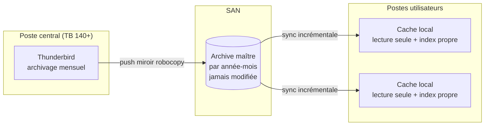

# Archives Mail Thunderbird — Distribution

Outils et procédure pour **décharger des boîtes mail saturées** (jusqu'à ~80 Go)
vers une **archive partagée sur le SAN**, consultable par plusieurs personnes
**sans risque de verrou ni de corruption**.

Le principe : on archive par année-mois sur un poste central, on pousse les
fichiers sur le SAN (archive « maître », jamais modifiée), puis chaque poste
utilisateur recopie l'archive dans un **cache local en lecture seule**. Deux
Thunderbird n'ouvrent ainsi jamais le même fichier → aucun verrou possible.

> ✅ **Version recommandée : Thunderbird 140 ESR (ou ultérieure).** Interface
> simplifiée, recherche par ancienneté et archivage **automatisable**. Compatible
> jusqu'à la **31.7.0** (voir *Compatibilité* dans le mode opératoire), mais
> privilégiez la 140+, surtout sur le **poste central**.

👉 **Procédure complète et détaillée : [MODE-OPERATOIRE.md](MODE-OPERATOIRE.md)**

## Démarrage rapide

> Vue d'ensemble. Chaque étape est détaillée (réglages Thunderbird, captures,
> cas IMAP/POP) dans le [mode opératoire](MODE-OPERATOIRE.md).

**Prérequis** : un partage SAN accessible en écriture depuis le poste central et
en lecture depuis les postes utilisateurs ; **Thunderbird 140+** (poste central) ;
rien d'autre à installer (les scripts n'utilisent que des outils natifs Windows).

**1. Poste central « mail » (archivage + envoi)** — voir
[MODE-OPERATOIRE.md § Partie 1](MODE-OPERATOIRE.md#partie-1--poste-central--mail--archivage--envoi-sur-le-san)
1. **Installer / migrer en Thunderbird 140+** (`scripts/5-installer-thunderbird-moderne.bat`, en administrateur).
2. Régler l'**archivage mensuel** (un dossier par année-mois).
   ⚠️ En IMAP, **télécharger d'abord les messages en entier** avant d'archiver.
3. Archiver, au choix :
   - **Recommandé (automatique)** : **installer le module [AutoarchiveReloaded](https://addons.thunderbird.net/en-US/thunderbird/addon/autoarchivereloaded/)**
     (☰ → *Modules complémentaires et thèmes* → rechercher **AutoarchiveReloaded** → *Ajouter*),
     puis le régler sur **plus de 90/180/365 j au démarrage** → il archive seul en gardant le classement année-mois.
   - **Manuel** : *Rechercher des messages* → critère **Ancienneté en jours** → Ctrl+A → touche **A**.
4. **Fermer Thunderbird**, adapter `BOITE`/`DEST` en tête de
   `scripts/1-push-archives-vers-san.bat`, puis le lancer → l'archive part sur le SAN.

**2. Poste utilisateur (consultation en lecture seule)** — voir
[MODE-OPERATOIRE.md § Partie 2](MODE-OPERATOIRE.md#partie-2--poste-utilisateur-consultation-en-lecture-seule)
1. Copier `scripts/2-sync-cache-local.bat` et `scripts/3-installer-tache-planifiee.bat`
   dans un dossier local (ex. `C:\Outils\`).
2. Adapter `SOURCE`/`NOM_DOSSIER` en tête de `2-sync-cache-local.bat`.
3. Lancer `3-installer-tache-planifiee.bat` (synchro auto : quotidienne + à l'ouverture
   de session), puis `2-sync-cache-local.bat` une 1re fois.
4. Redémarrer Thunderbird → le dossier **Archives-Partagees** apparaît sous
   *Dossiers locaux*, en lecture seule.

## Tests à mener (recette)

À valider une fois sur un **environnement de test** (une boîte non critique,
deux postes utilisateurs) avant tout déploiement réel. Détails et dépannage :
[MODE-OPERATOIRE.md](MODE-OPERATOIRE.md).

- [ ] **Archivage mensuel** : après archivage, Thunderbird crée bien un dossier
      **par année-mois** (et non un seul gros fichier).
- [ ] **IMAP — pas de perte** : sur une boîte IMAP, vérifier qu'un message archivé
      reste **lisible en entier hors-ligne** (corps + pièces jointes), pas seulement l'en-tête.
- [ ] **Push SAN** : `1-push-archives-vers-san.bat` se termine sans erreur,
      le SAN contient l'arborescence année-mois et un `_journal-push.log` est écrit.
- [ ] **Index non copiés** : aucun fichier `.msf` n'a été poussé sur le SAN
      (les index restent locaux à chaque poste).
- [ ] **Synchro utilisateur** : `2-sync-cache-local.bat` recopie l'archive ;
      après redémarrage de Thunderbird, le dossier **Archives-Partagees** est visible.
- [ ] **Lecture seule** : sur un poste utilisateur, vérifier qu'on **ne peut pas
      supprimer/modifier** un message archivé (intégrité de l'archive maître).
- [ ] **Aucun verrou inter-postes** : ouvrir la **même archive sur deux postes
      simultanément** → les deux lisent sans blocage ni message de verrou.
- [ ] **Synchro incrémentale** : une 2ᵉ synchro après un nouveau mois ne recopie
      **que le mois ajouté** (l'historique ne retransite pas).
- [ ] **Tâche planifiée** : `3-installer-tache-planifiee.bat` crée bien les tâches ;
      vérifier le déclenchement (à 07h30 et/ou à l'ouverture de session) via le journal.
- [ ] **Multi-versions** : si le parc mélange plusieurs versions de Thunderbird,
      vérifier l'affichage de l'archive sur au moins une version ancienne et une récente.
- [ ] **Archivage automatisé** *(méthode recommandée, TB 140+)* : après installation
      du module, vérifier qu'au démarrage les messages au-delà du seuil sont bien
      archivés **par année-mois** (et non dans un dossier unique).

## Structure du dépôt

| Dossier / fichier      | Contenu                                                                 |
|------------------------|-------------------------------------------------------------------------|
| `MODE-OPERATOIRE.md`   | Procédure pas-à-pas + **schémas Mermaid** (architecture, processus, anti-verrou) |
| `Note-de-cadrage.docx` | Note de cadrage du projet                                               |
| `scripts/`             | Scripts Windows `.bat` (push vers SAN, synchro cache local, tâche planifiée, install TB) |
| `schemas/`             | Schémas sources détaillés (`drawio/` éditables, `png/` rendus) — les schémas Mermaid sont, eux, intégrés au Markdown |
| `private/`             | Sorties locales sensibles — **ignoré par git** (voir `private/README.md`) |

## Scripts (`scripts/`)

> Les scripts contiennent des **placeholders** à adapter une seule fois
> (`\\SERVEUR-SAN\...`, `prenom.nom`). Aucune valeur réelle n'est versionnée.

| Script                              | Rôle                                                       |
|-------------------------------------|------------------------------------------------------------|
| `1-push-archives-vers-san.bat`      | Poste central : envoie les archives Thunderbird vers le SAN |
| `2-sync-cache-local.bat`            | Poste utilisateur : recopie l'archive du SAN en cache local |
| `3-installer-tache-planifiee.bat`   | Installe la synchro automatique (tâche planifiée Windows)   |
| `5-installer-thunderbird-moderne.bat` | **Poste central** : installe Thunderbird ESR 140+ (silencieux) — base de l'archivage automatisé |
| `policies.json.exemple`             | **Parc** : modèle de stratégie d'entreprise forçant l'installation du module d'auto-archivage |
| `aide-dates-archivage.bat`          | *(Compat. 31–45)* Calcule les dates butoir « il y a 3/6/12 mois » pour l'archivage manuel |

## Hygiène du dépôt

- `.gitignore` durci : `private/`, secrets (`.env`, clés, `*.pem`…), fichiers OS
  (`.DS_Store`, `Thumbs.db`), journaux `*.log`.
- Anti-fuite **local et bloquant** : hook pre-commit
  [gitleaks](https://github.com/gitleaks/gitleaks) (`.pre-commit-config.yaml`).
  Installation : `pre-commit install`. Un commit contenant un secret est refusé.
